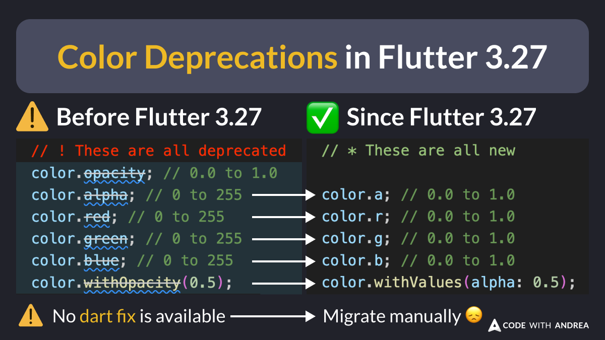

# Color API Deprecations in Flutter 3.27

Did you know?

To support the latest [wide gamut color spaces](https://en.wikipedia.org/wiki/RGB_color_spaces), Flutter 3.27 has deprecated some properties and methods in the `Color` class. 🌈

⚠️ No Dart fix command is available for this breaking change, so you'll need to migrate your code manually.

<!--
// Before Flutter 3.27
// ! These are all deprecated
color.opacity; // 0.0 to 1.0
color.alpha; // 0 to 255
color.red; // 0 to 255
color.green; // 0 to 255
color.blue; // 0 to 255
color.withOpacity(0.5);

// Since Flutter 3.27
// * These are all new

color.a; // 0.0 to 1.0
color.r; // 0.0 to 1.0
color.g; // 0.0 to 1.0
color.b; // 0.0 to 1.0
color.withValues(alpha: 0.5);
-->

---

Learn more about this breaking change here:

- [Migration guide for wide gamut Color](https://docs.flutter.dev/release/breaking-changes/wide-gamut-framework)

---

| Previous | Next |
| -------- | ---- |
| [Text Style with Tabular Figures](../0218-text-style-tabular-figures/index.md) | [The ListWheelScrollView Widget](../0220-list-wheel-scroll-view/index.md) |

<!-- TWITTER|https://x.com/biz84/status/1869357562979893444 -->
<!-- LINKEDIN|https://www.linkedin.com/posts/andreabizzotto_did-you-know-to-support-the-latest-wide-activity-7275123561881645057-LsKH -->
<!-- BLUESKY|https://bsky.app/profile/codewithandrea.com/post/3ldldwzh6l22f -->