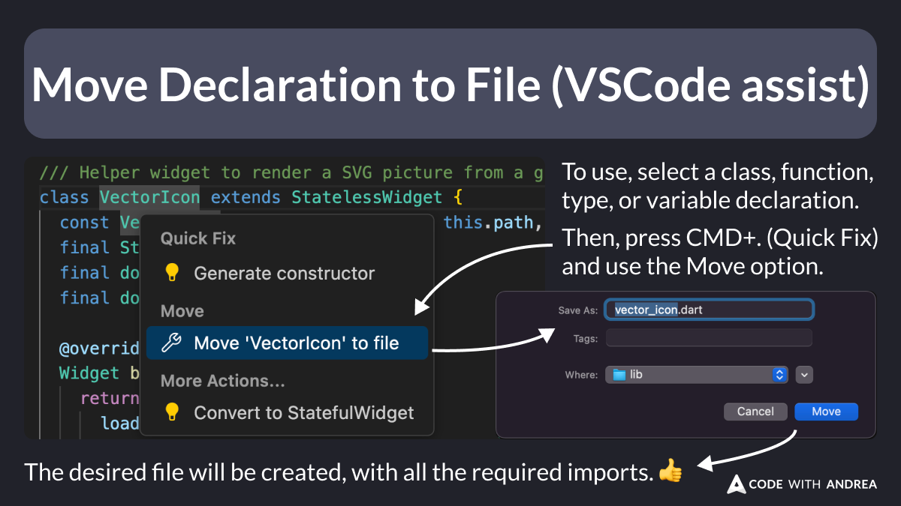

# Move Declaration to File (VSCode assist)

Did you know?

With VSCode, you can easily move your Dart classes and functions to a different file.

To use this, select any declaration name and press `CMD+.`, then use the Move option.

The desired file will be created with all the required imports. 👍

<!--

Move Declaration to File (VSCode assist)

To use, select a class, function, type or variable declaration.
Then, press CMD+x (Quick Fix) and use the Move option.

The desired file will be created with all the required imports.

/// Helper widget to render a SVG picture from a given asset
class VectorIcon extends StatelessWidget {
  const VectorIcon({super.key, required this.path, this.width, this.height});
  final String path;
  final double? width;
  final double? height;

  @override
  Widget build(BuildContext context) {
    return VectorGraphic(
      loader: AssetBytesLoader(path),
      width: width,
      height: height,
    );
  }
}

-->

---

| Previous | Next |
| -------- | ---- |
| [Using Stack and FractionallySizedBox](../0221-stack-fractionally-sized-box/index.md) | |

<!-- TWITTER|https://x.com/biz84/status/1876983674735849540 -->
<!-- LINKEDIN|https://www.linkedin.com/posts/andreabizzotto_did-you-know-with-vscode-you-can-easily-activity-7282749783033741314-qVCu -->
<!-- BLUESKY|https://bsky.app/profile/codewithandrea.com/post/3lfabcatbhs2r -->

