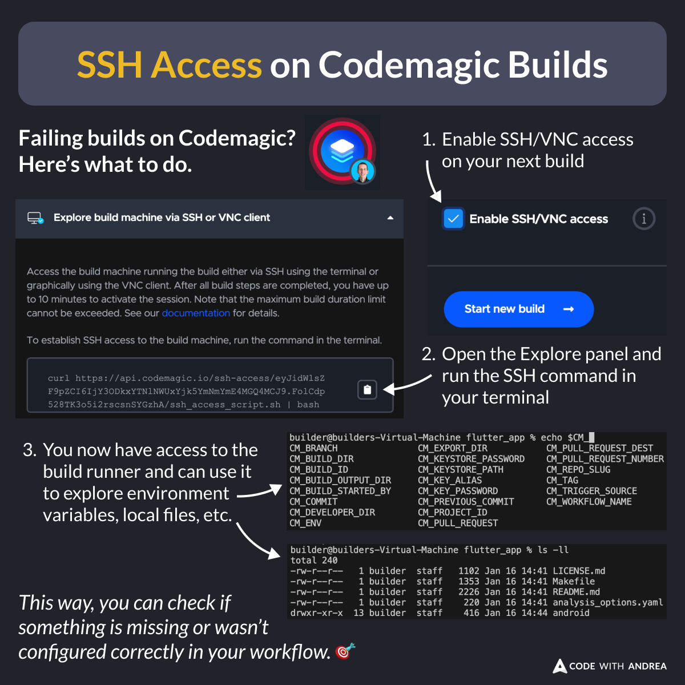

# SSH Access on Codemagic Builds

Did you know?

If your Codemagic builds are failing and you can't figure out why, you can enable SSH access. 🔑

Use this to login to the build runner, where you can inspect the environment variables and project files, and see if something is missing. 💡

<!--

Failing builds on Codemagic? Here's what to do:

1. Enable SSH/VNC access on your next build
2. Open the Explore panel and run the SSH command in your terminal
3. You now have access to the build runner and can use it to explore environment variables, local files, etc.

This way, you can check if something is missing or wasn't configured correctly in your workflow. 🎯

-->

---

I just added a whole module about CI/CD automation with Codemagic to my Flutter in Production course.

If you want to check it out, here's the intro:

- [Introduction to CI/CD](https://pro.codewithandrea.com/flutter-in-production/11-codemagic/01-intro)

---

| Previous | Next |
| -------- | ---- |
| [Move Declaration to File (VSCode assist)](../0222-move-to-file-vscode-assist/index.md) | [Uploading the Source Maps to Sentry](../0224-upload-source-maps-sentry/index.md) |

<!-- TWITTER|https://x.com/biz84/status/1879922615026151473 -->
<!-- LINKEDIN|https://www.linkedin.com/posts/andreabizzotto_did-you-know-if-your-codemagic-builds-are-activity-7285688423271530496-XY0x  -->
<!-- BLUESKY|https://bsky.app/profile/codewithandrea.com/post/3lfunvdmhjc2w -->

