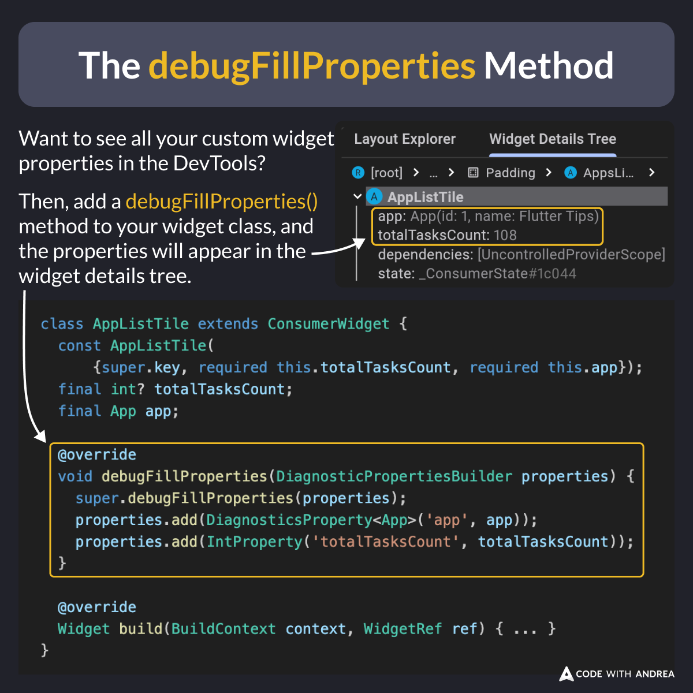

# The debugFillProperties Method

Did you know?

If you add a `debugFillProperties()` method to your widget classes, all your custom properties will show in the DevTools.

This information is useful for debugging purposes and has no performance impact on release builds (where it is stripped).

<!--

class AppListTile extends ConsumerWidget {
  const AppListTile(
      {super.key, required this.totalTasksCount, required this.app});
  final int? totalTasksCount;
  final App app;

  @override
  void debugFillProperties(DiagnosticPropertiesBuilder properties) {
    super.debugFillProperties(properties);
    properties.add(DiagnosticsProperty<App>('app', app));
    properties.add(IntProperty('totalTasksCount', totalTasksCount));
  }

  @override
  Widget build(BuildContext context, WidgetRef ref) { ... }
}

-->

---

To learn more about all the supported property types and variants, read the official docs:

- [debugFillProperties method](https://api.flutter.dev/flutter/widgets/State/debugFillProperties.html)

---

| Previous | Next |
| -------- | ---- |
| [Uploading the Source Maps to Sentry](../0224-upload-source-maps-sentry/index.md) | |

<!-- TWITTER|https://x.com/biz84/status/1882486196133404933 -->
<!-- LINKEDIN|https://www.linkedin.com/posts/andreabizzotto_did-you-know-if-you-add-a-debugfillproperties-activity-7288252423486234624-KdP-  -->
<!-- BLUESKY|https://bsky.app/profile/codewithandrea.com/post/3lggh4vqfas2r -->