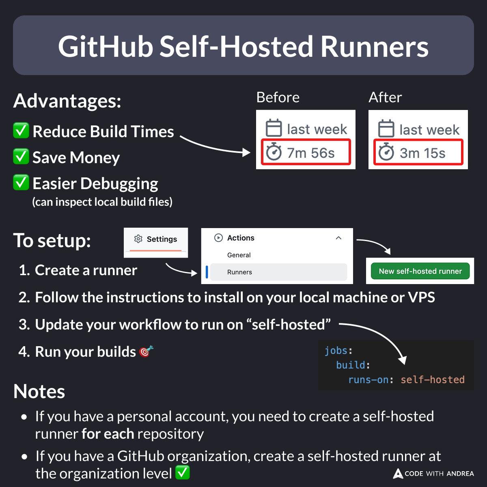

# GitHub Self-Hosted Runners

Did you know?

If you're using GitHub Actions for your CI/CD needs, you can setup a self-hosted runner to cut your build times and save money. 🎯

This is very easy to setup, and if you have an organization account, you can share one or more runners across all your repos. 👍

<!--

GitHub Self-Hosted Runners

Advantages:

- Reduce build times
- Save money
- Easier debugging (can inspect local build files)

To setup:
1. Create a runner
2. Follow the instructions to install on your local machine or VPS
3. Update your workflow to run on "self-hosted"
4. Run your builds

Notes:
- If you have a personal account, you need to create a self-hosted runner for each repository
- If you have a GitHub organization, create a self-hosted runner at the organization level ✅

-->

---

My latest course includes a whole module about GitHub Actions, showing how to make your pipelines faster, more reliable, and easier to manage.

A complete workflow for Android & iOS is also included as a reference.

To learn more, check the module intro:

- [Introduction to GitHub Actions](https://pro.codewithandrea.com/flutter-in-production/12-github-actions/01-intro)

---

| Previous | Next |
| -------- | ---- |
| [The debugFillProperties Method](../0225-debug-fill-properties/index.md) | |

<!-- TWITTER|https://x.com/biz84/status/1887441742028214765 -->
<!-- LINKEDIN|https://www.linkedin.com/posts/andreabizzotto_did-you-know-if-youre-using-github-actions-activity-7293207844273684480-yjhQ  -->
<!-- BLUESKY|https://bsky.app/profile/codewithandrea.com/post/3lhitlc5lqs2m -->