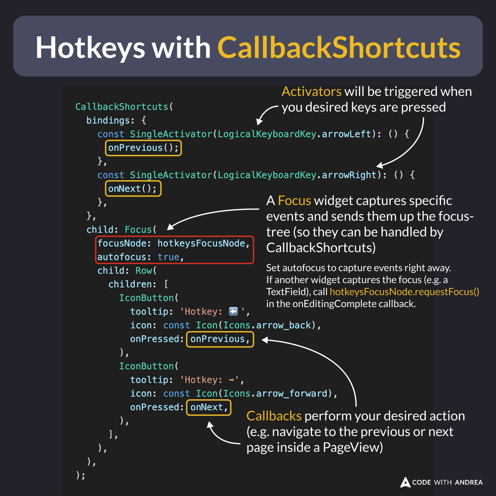

# Hotkeys with CallbackShortcuts

Did you know?

The `CallbackShortcuts` widget makes it easy to add keyboard shortcuts to your Flutter app.

To use it:

1. Add one or more key bindings using `SingleActivator`
2. Add a `Focus` widget to capture the desired events
3. Use callbacks to perform your desired actions

<!--
CallbackShortcuts(
  bindings: {
    const SingleActivator(LogicalKeyboardKey.arrowLeft): () {
      onPrevious();
    },
    const SingleActivator(LogicalKeyboardKey.arrowRight): () {
      onNext();
    },
  },
  child: Focus(
    focusNode: hotkeysFocusNode,
    autofocus: true,
    child: Row(
      children: [
        IconButton(
          tooltip: 'Hotkey: ⬅️',
          icon: const Icon(Icons.arrow_back),
          onPressed: onPrevious,
        ),
        IconButton(
          tooltip: 'Hotkey: ➡️',
          icon: const Icon(Icons.arrow_forward),
          onPressed: onNext,
        ),
      ],
    ),
  ),
);
-->

---

Note: the activators will only be triggered when there's a **focused** child widget.

The easiest way to do this is to wrap your child widget in a `Focus` widget with `autofocus: true`.

If other widgets also rely on active focus, you can explicitly request focus with a `FocusNode`.

---

For more details about `CallbackShortcuts`, check this video:

- [CallbackShortcuts (Widget of the Week)](https://youtu.be/VcQQ1ns_qNY?si=61hK4ZvPLDoU7Zox)

---

To dive deeper and learn what to do when things don't work as you expect, watch this three-part series. 👇

- [Part 1: Focus (Widget of the Week)](https://youtu.be/JCDfh5bs1xc?si=ExrsMnyUqi1GzEL_)
- [Part 2: Shortcuts (Widget of the Week)](https://youtu.be/6ZcQmdoz9N8?si=2f-IdXFkv43S6taX)
- [Part 3: Actions (Widget of the Week)](https://youtu.be/XawP1i314WM?si=cESt4-bbVVNlLAzp)

---

If you want to see this technique in action, check my Flutter Tips app (web version):

- [Flutter Tips web app](https://app.fluttertips.dev/)

This supports three different keyboard shortcuts:

- **Left arrow**: go to the previous tip
- **Space**: favorite/unfavorite a tip
- **Right arrow**: go to the next tip

---

| Previous | Next |
| -------- | ---- |
| [GitHub Self-Hosted Runners](../0226-github-self-hosted-runners/index.md) | |

<!-- TWITTER|https://x.com/biz84/status/1889311863759913078 -->
<!-- LINKEDIN|https://www.linkedin.com/posts/andreabizzotto_did-you-know-the-callbackshortcuts-widget-activity-7295078648250810368-p2J_  -->
<!-- BLUESKY|https://bsky.app/profile/codewithandrea.com/post/3lhvst66e2k2f -->

