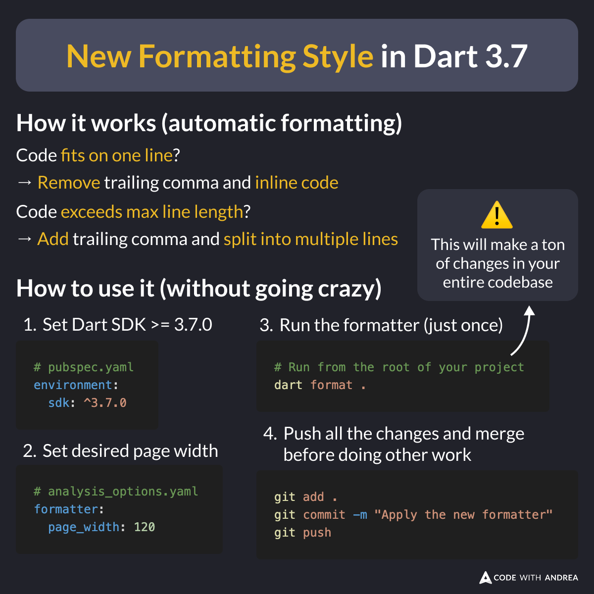

# New Formatting Style in Dart 3.7

Did you know?

Dart 3.7 introduces a new formatter that **automatically** adds or removes trailing commas, based on the max line length.

This means you no longer decide how to format your code! The tool now does it for you.

<!--

How it works (automatic formatting)

- Code fits on one line?
  - Remove trailing comma and inline code
- Code exceeds max line length?
  - Add trailing comma and split into multiple lines

How to use it (without going crazy)

# Set Dart SDK >= 3.7.0 in pubspec.yaml
environment:
  sdk: ^3.7.0

# Set page_width in analysis_options.yaml
formatter:
  page_width: 120

# Run from the root of your project
dart format . # This will make a ton of changes in your entire codebase

# Push all changes at once
git add .
git commit -m "Apply the new formatter"
git push

-->

---

The new change affects all Flutter developers.

So I created this guide to help you handle it smoothly in your projects. 👇

- [There's a New Formatting Style in Dart 3.7 (Here's What It Means for You)](https://codewithandrea.com/articles/new-formatting-style-dart-3-7/)

---

| Previous | Next |
| -------- | ---- |
| [Wildcard Variables in Dart 3.7](../0228-wildcard-variables-dart-3.7/index.md) | [Side Effects with ValueNotifier](../0230-side-effects-value-notifier/index.md) |

<!-- TWITTER|https://x.com/biz84/status/1890039998814261546 -->
<!-- LINKEDIN|https://www.linkedin.com/posts/andreabizzotto_did-you-know-dart-37-introduces-a-new-activity-7295806189295075329-BG1O  -->
<!-- BLUESKY|https://bsky.app/profile/codewithandrea.com/post/3li2uffje522h -->

