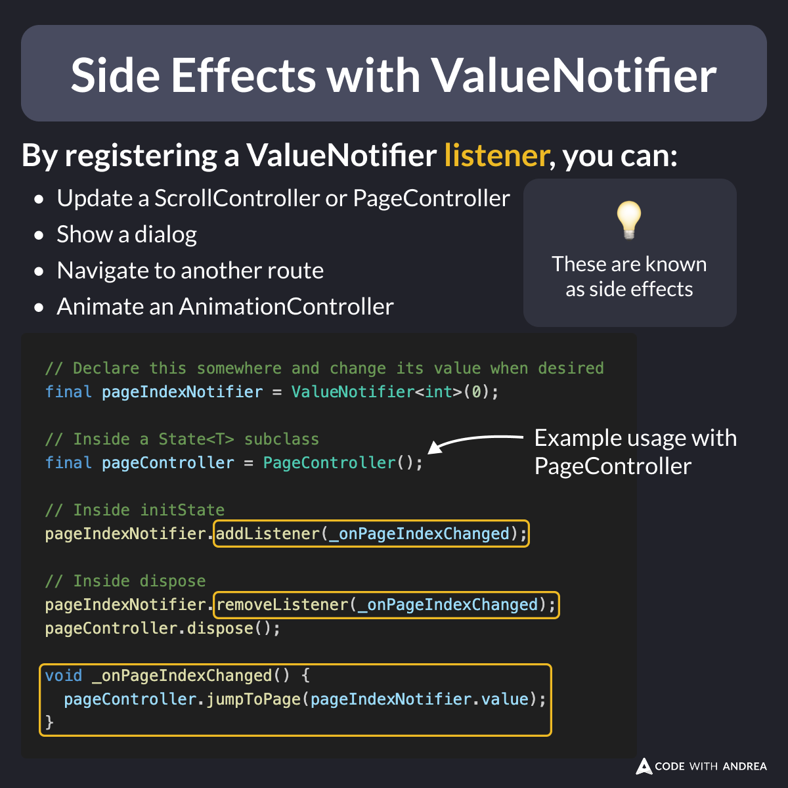

# Side Effects with ValueNotifier

Did you know?

By registering a `ValueNotifier` listener, you can perform various side effects such as:

- Updating a `ScrollController`, `PageController`, `AnimationController`, etc.
- Showing a dialog 
- Navigating to another route

Note: This works with `ChangeNotifier`, too. 💡

<!--

By registering a ValueNotifier listener, you can:
- Update a ScrollController, PageController, AnimationController, etc.
- Show a dialog
- Navigate to another route

// Example code using PageController:
// Declare this somewhere and change its value when desired
final pageIndexNotifier = ValueNotifier<int>(0);

// Inside a State<T> subclass
final pageController = PageController();

// Inside initState
pageIndexNotifier.addListener(_onPageIndexChanged);

// Inside dispose
pageIndexNotifier.removeListener(_onPageIndexChanged);
pageController.dispose();

void _onPageIndexChanged() {
  pageController.jumpToPage(pageIndexNotifier.value);
}
-->

---

Important: side effects should **never** be performed from the `build` method.

To learn more and avoid common mistakes, check this article:

- [Side Effects in Flutter: What They Are and How to Handle Them](https://codewithandrea.com/articles/side-effects-flutter/)

---

| Previous | Next |
| -------- | ---- |
| [New Formatting Style in Dart 3.7](../0229-new-formatting-style-dart-3.7/index.md) | [Downloads Count by Version on Pub.dev](../0231-download-counts-by-version/index.md) |

<!-- TWITTER|https://x.com/biz84/status/1895038901078945931 -->
<!-- LINKEDIN|https://www.linkedin.com/posts/andreabizzotto_did-you-know-by-registering-a-valuenotifier-activity-7300804765456781312-LQ_k -->
<!-- BLUESKY|https://bsky.app/profile/codewithandrea.com/post/3lj5kf362wc2u -->
