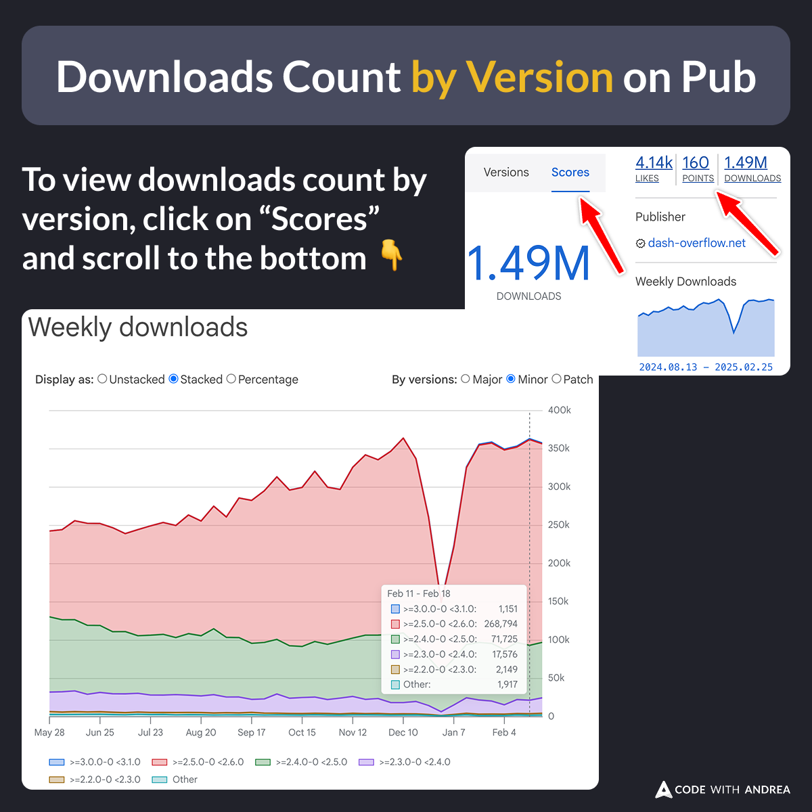

# Downloads Count by Version on Pub.dev

Did you know?

An improved weekly downloads chart was recently added on [pub.dev](https://pub.dev/).

This lets you see package download counts by version (major, minor, patch).

To view it, click on the scores tab and scroll to the bottom (took me a while to find it 😅).

---

| Previous | Next |
| -------- | ---- |
| [Side Effects with ValueNotifier](../0230-side-effects-value-notifier/index.md) | [The flutter run --route argument](../0232-flutter-run-route/index.md) |

<!--

To view download counts by version, click on the Scores tab and scroll to the bottom.

-->

<!-- TWITTER|https://x.com/biz84/status/1895396402924261615 -->
<!-- LINKEDIN|https://www.linkedin.com/posts/andreabizzotto_did-you-know-an-improved-weekly-downloads-activity-7301162295122952192-AD8w -->
<!-- BLUESKY|https://bsky.app/profile/codewithandrea.com/post/3lj7zrfg2qk2f -->
