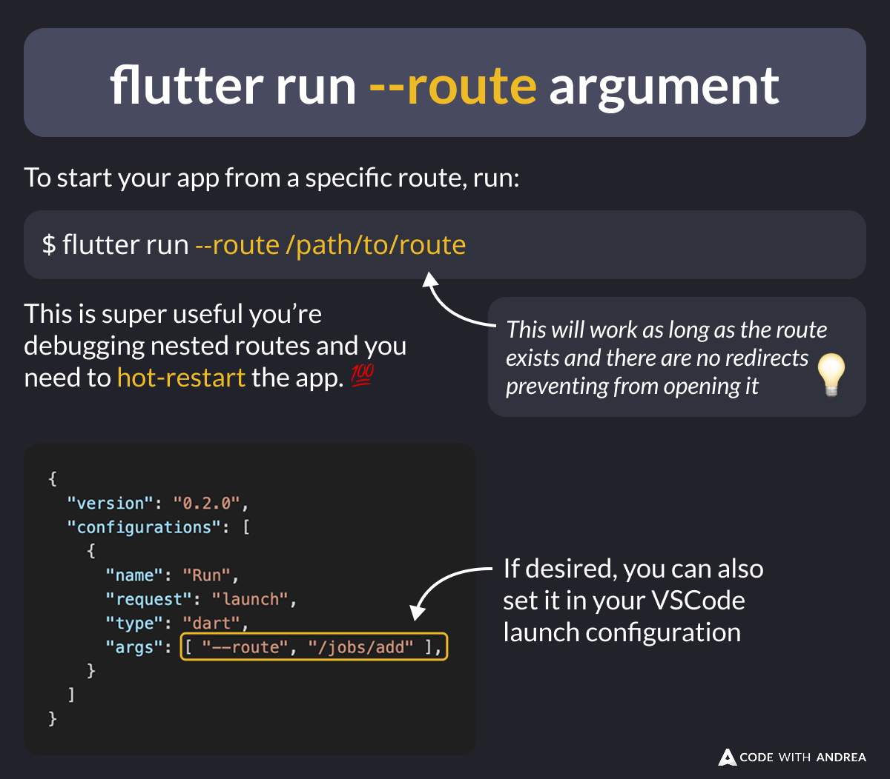

# The flutter run --route argument

Did you know?

You can run `flutter run --route /path/to/route` to start your Flutter app from a specific route.

This works with named routes (nav 1.0) and the router APIs (nav 2.0).

Super useful for debugging nested routes when you need to hot-restart.

<!--

To start your app from a specific route, run:

flutter run --route /path/to/route

This is super useful you’re debugging nested routes and you need to hot-restart the app. 💯

This will work as long as the route exists and there are no redirects preventing from opening it.

---

If desired, you can also set it in your VSCode launch configuration:

{
  "version": "0.2.0",
  "configurations": [
    {
      "name": "Run",
      "request": "launch",
      "type": "dart",
      "args": [ "--route", "/jobs/add" ],
    }
  ]
}

-->

---

| Previous | Next |
| -------- | ---- |
| [Downloads Count by Version on Pub.dev](../0231-download-counts-by-version/index.md) | [Gradle Kotlin DSL (Flutter 3.29)](../0233-gradle-kotlin-dsl/index.md) |

<!-- TWITTER|https://x.com/biz84/status/1896857999890604465 -->
<!-- LINKEDIN|https://www.linkedin.com/posts/andreabizzotto_did-you-know-you-can-run-flutter-run-activity-7302623534877401089-fr-I -->
<!-- BLUESKY|https://bsky.app/profile/codewithandrea.com/post/3ljk6bi3m5s2m -->