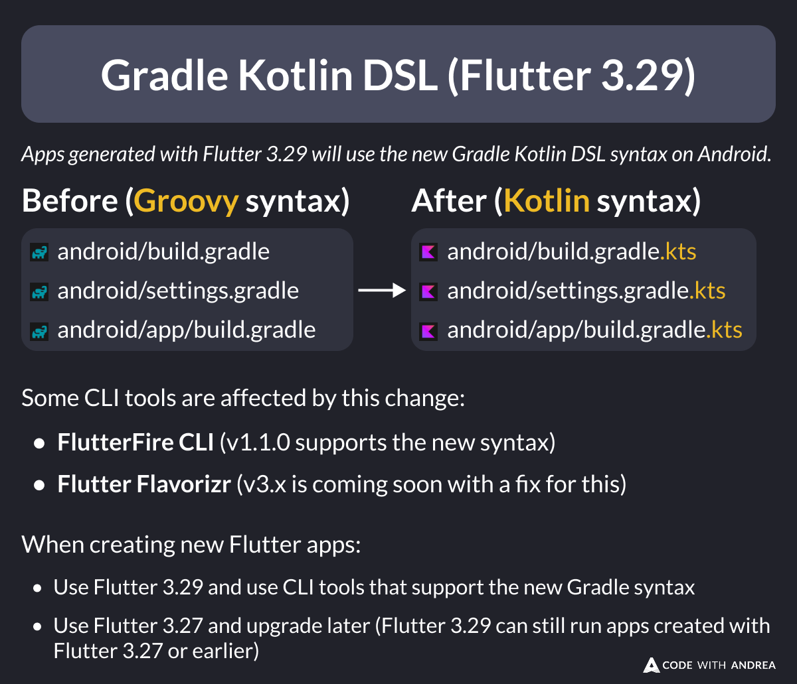

# Gradle Kotlin DSL (Flutter 3.29)

Did you know?

New apps created with Flutter 3.29 use the new Gradle Kotlin DSL on Android.

This may affect you if you rely on CLI tools that don't support the new syntax.

Here's what you need to know. 👇

<!--

Apps generated with Flutter 3.29 will use the new Gradle Kotlin DSL syntax on Android.

Before (Groovy syntax):

- android/build.gradle
- android/settings.gradle
- android/app/build.gradle

After (Kotlin syntax):

- android/build.gradle.kts
- android/settings.gradle.kts
- android/app/build.gradle.kts

Some CLI tools are affected by this change:

- FlutterFire CLI (v1.1.0 supports the new syntax)
- Flutter Flavorizr (v3.x is coming soon with a fix for this)

When creating new Flutter apps:

- Use Flutter 3.29 and use CLI tools that support the new Gradle syntax
- Use Flutter 3.27 and upgrade later (Flutter 3.29 can still run apps created with Flutter 3.27 or earlier)

-->

---

| Previous | Next |
| -------- | ---- |
| [The flutter run --route argument](../0232-flutter-run-route/index.md) | [iOS Status Bar tip for Better Screenshots](../0234-ios-status-bar-for-screenshots/index.md) |

<!-- TWITTER|https://x.com/biz84/status/1899104439077601668 -->
<!-- LINKEDIN|https://www.linkedin.com/posts/andreabizzotto_did-you-know-new-apps-created-with-flutter-activity-7304870272443052033-ulgB -->
<!-- BLUESKY|https://bsky.app/profile/codewithandrea.com/post/3ljzr46sges2f -->