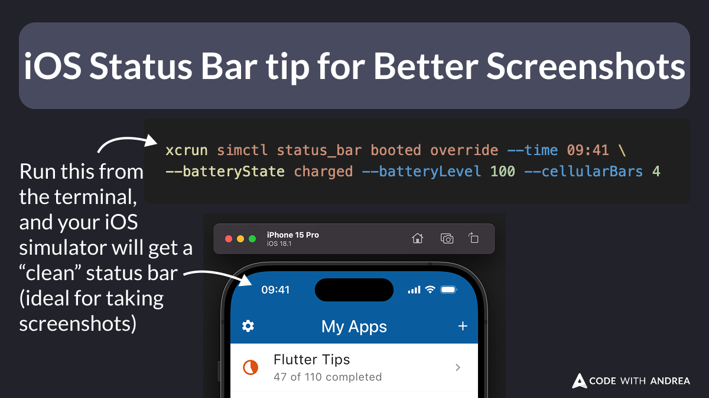

# iOS Status Bar Tip for Better Screenshots

Did you know?

You can use this command to clean up the iOS status bar before taking screenshots:

```
xcrun simctl status_bar booted override --time 09:41 --batteryState charged --batteryLevel 100 --cellularBars 4
```



<!--
Run this from the terminal, and your iOS simulator will get a “clean” status bar (ideal for taking screenshots):

xcrun simctl status_bar booted override --time 09:41 --batteryState charged --batteryLevel 100 --cellularBars 4
-->

Then, you can take screenshots manually (`CMD+S` on macOS), or automate the process with [Maestro](https://docs.maestro.dev/).

Once you're done, reset the status bar like this:

```text
xcrun simctl status_bar booted clear
```

Happy coding!


---

| Previous | Next |
| -------- | ---- |
| [Gradle Kotlin DSL (Flutter 3.29)](../0233-gradle-kotlin-dsl/index.md) | [Android Demo Mode for Better Screenshots](../0235-android-demo-mode-for-screenshots/index.md) |


<!-- TWITTER|https://x.com/biz84/status/1900226263131799776 -->
<!-- LINKEDIN|https://www.linkedin.com/posts/andreabizzotto_did-you-know-you-can-use-this-command-to-activity-7305992157113274369--Vwc -->
<!-- BLUESKY|https://bsky.app/profile/codewithandrea.com/post/3lkbk5n7zbc2x -->


