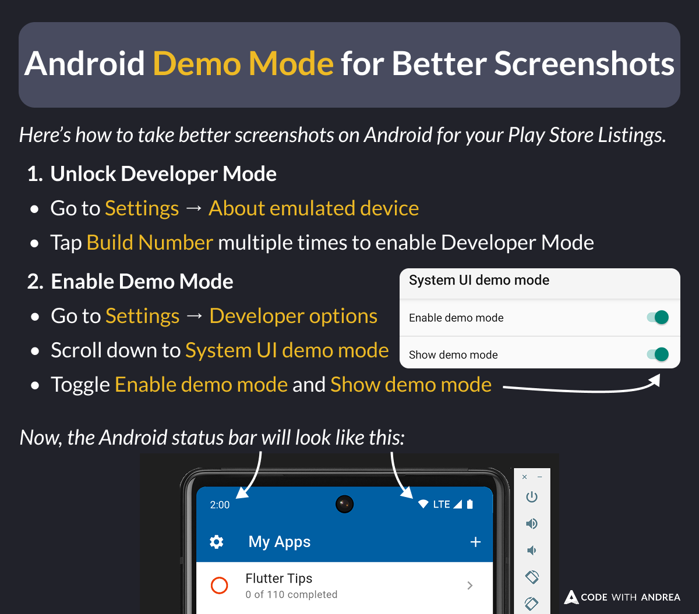

# Android Demo Mode for Better Screenshots

Did you know?

If you want to take better screenshots for your Play Store listings, you can enable Demo Mode in the Android settings.

Here's how to enable this. 👇

<!--

Here’s how to take better screenshots on Android for your Play Store Listings.

1. Unlock Developer Mode
  - Go to Settings → About emulated device
  - Tap Build Number multiple times to enable Developer Mode
2. Enable Demo Mode
  - Go to Settings → Developer options
  - Scroll down to System UI demo mode
  - Toggle Enable demo mode and Show demo mode

Now, the Android status bar will show 2:00 as the time and 100% battery.
-->

---

| Previous | Next |
| -------- | ---- |
| [iOS Status Bar tip for Better Screenshots](../0234-ios-status-bar-for-screenshots/index.md) | [Generate Screenshots with Maestro](../0236-take-screenshots-maestro/index.md) | [link](https://x.com/biz84/status/1901668347097313597) |

<!-- TWITTER|https://x.com/biz84/status/1900522513588769112 -->
<!-- LINKEDIN|https://www.linkedin.com/posts/andreabizzotto_did-you-know-if-you-want-to-take-better-activity-7306288388351946752-VkeK -->
<!-- BLUESKY|https://bsky.app/profile/codewithandrea.com/post/3lkdlwnxyik2x -->
