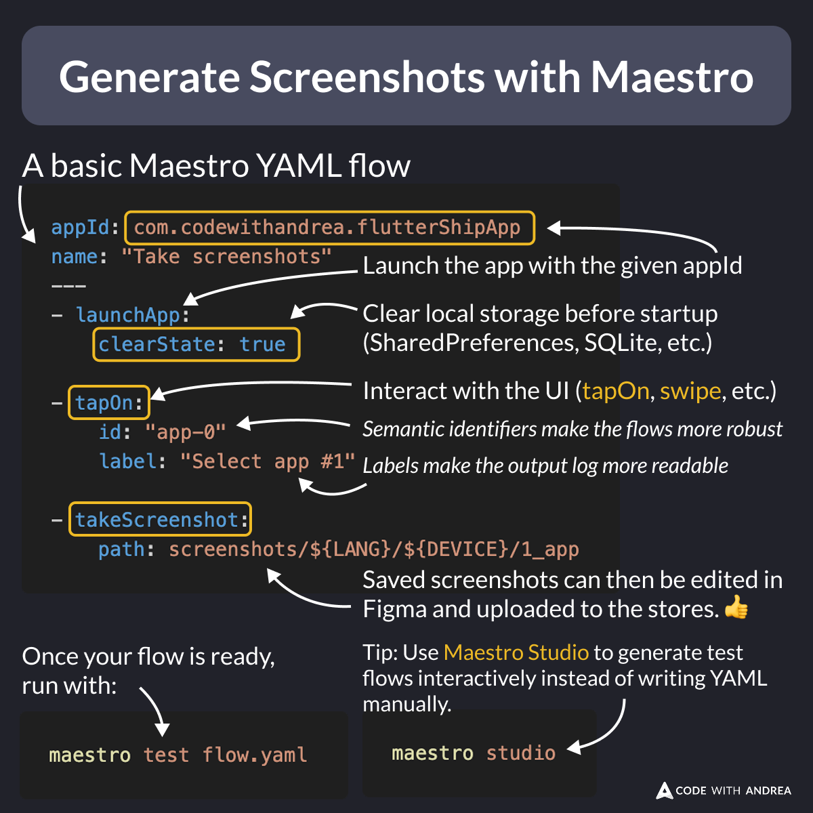

# Generate Screenshots with Maestro

Did you know?

Instead of taking screenshots manually for each device & language, you can automate it with Maestro!

Here's a video preview:

- [Example screenshot generation flow with Maestro](https://youtu.be/oUWf9tYc4kQ)

---

How to use this in practice?

Simply write a YAML file to define how Maestro should interact with your app UI and call `takeScreenshot` as needed.

Super easy—no test harness required! 🚀



<!--
# A basic Maestro YAML flow
# Launch the app with the given appId
appId: com.codewithandrea.flutterShipApp
name: "Take screenshots"
---
- launchApp:
    # Clear local storage before startup (SharedPreferences, SQLite, etc.)
    clearState: true

- tapOn:
    # Semantic identifiers make the flows more robust
    id: "app-0"
    # Labels make the output log more readable
    label: "Select app #1"

- takeScreenshot:
    # Saved screenshots can then be edited in Figma and uploaded to the stores.
    path: screenshots/${LANG}/${DEVICE}/1_app

Once your flow is ready, run with:
maestro test flow.yaml

Tip: Use Maestro Studio to generate test flows interactively instead of writing YAML manually:
maestro studio
```
-->

---

To get started, check the official docs:

- [What is Maestro?](https://docs.maestro.dev/)

---

### Flutter in Production course

My latest course includes a whole module about screenshot automation, covering:

- ✅ Tips for better screenshots
- ✅ Capturing screenshots with Maestro
- ✅ Editing them with Figma
- ✅ Uploading to the stores with Fastlane (locally & on CI)

Learn more here:

- [Flutter in Production](https://codewithandrea.com/courses/flutter-in-production/)

---

| Previous | Next |
| -------- | ---- |
| [Android Demo Mode for Better Screenshots](../0235-android-demo-mode-for-screenshots/index.md) | [Using Semantics Identifiers for UI Testing](../0237-semantics-identifiers/index.md) | 

<!-- TWITTER|https://x.com/biz84/status/1901668347097313597 -->
<!-- LINKEDIN|https://www.linkedin.com/posts/andreabizzotto_did-you-know-instead-of-taking-screenshots-activity-7307435080732278784-17-j -->
<!-- BLUESKY|https://bsky.app/profile/codewithandrea.com/post/3lklkimc5rc2y -->


