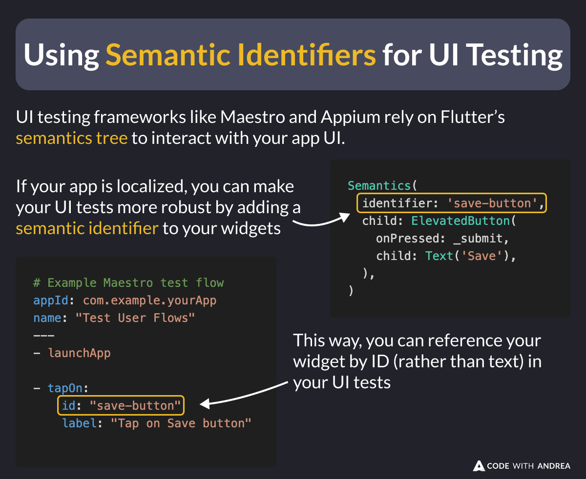

# Using Semantics Identifiers for UI Testing

Did you know?

UI testing frameworks like Maestro and Appium rely on Flutter’s **semantics tree** to interact with your app UI.

If your app is localized, you can make your UI tests more robust by adding a **semantic identifier** to your widgets:

Here's how. 👇

<!--

UI testing frameworks like Maestro and Appium rely on Flutter’s semantics tree to interact with your app UI.

If your app is localized, you can make your UI tests more robust by adding a semantic identifier to your widgets:

Semantics(
  identifier: 'save-button',
  child: ElevatedButton(
    onPressed: _submit,
    child: Text('Save'),
  ),
)

This way, you can reference your widget by ID (rather than text) in your UI tests

# Example Maestro test flow
appId: com.example.yourApp
name: "Test User Flows"
---
- launchApp

- tapOn:
    id: "save-button"
    label: "Tap on Save button"

-->

---

If you want to dig deeper, here's an excellent article explaining how Flutter's semantics tree maps with the native accessibility tree:

- [The power of open-source. Making Maestro work better with Flutter](https://www.maestro.dev/blog/the-power-of-open-source-making-maestro-work-better-with-flutter)

---

To learn more about UI testing, screenshot generation, and more, check the latest module in my Flutter in Production course:

- [Introduction to Automated Screenshot Generation](https://pro.codewithandrea.com/flutter-in-production/14-screenshots/01-intro)

| Previous | Next |
| -------- | ---- |
| [Generate Screenshots with Maestro](../0236-take-screenshots-maestro/index.md) | [Uploading Screenshots with Fastlane](../0238-uploading-screenshots-fastlane/index.md) |

<!-- TWITTER|https://x.com/biz84/status/1901966299246268467 -->
<!-- LINKEDIN|https://www.linkedin.com/posts/andreabizzotto_did-you-know-ui-testing-frameworks-like-activity-7307732520383533060-WCi3 -->
<!-- BLUESKY|https://bsky.app/profile/codewithandrea.com/post/3lknmknavvk2y -->
