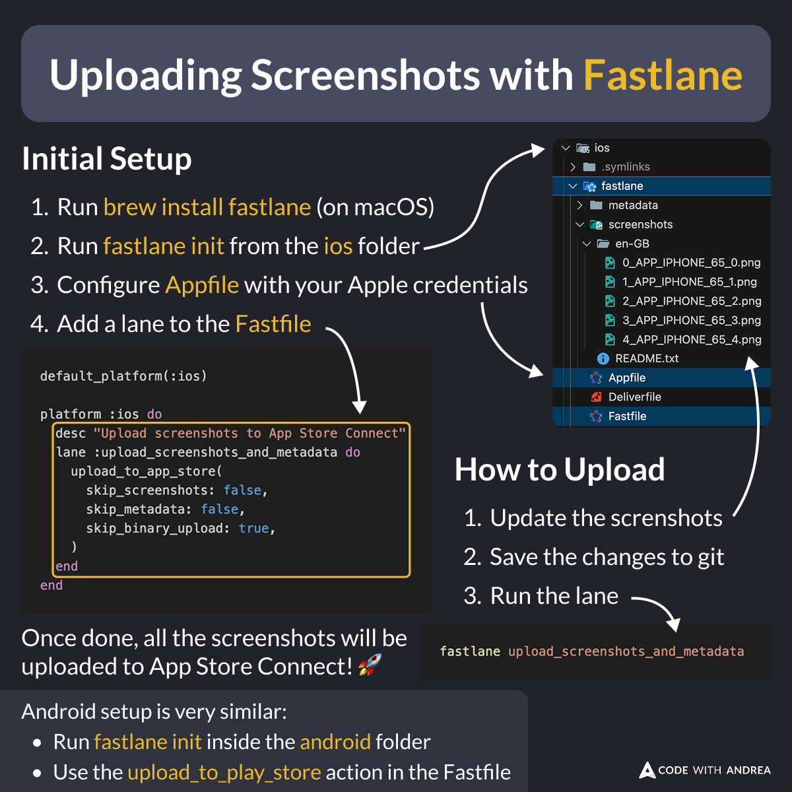
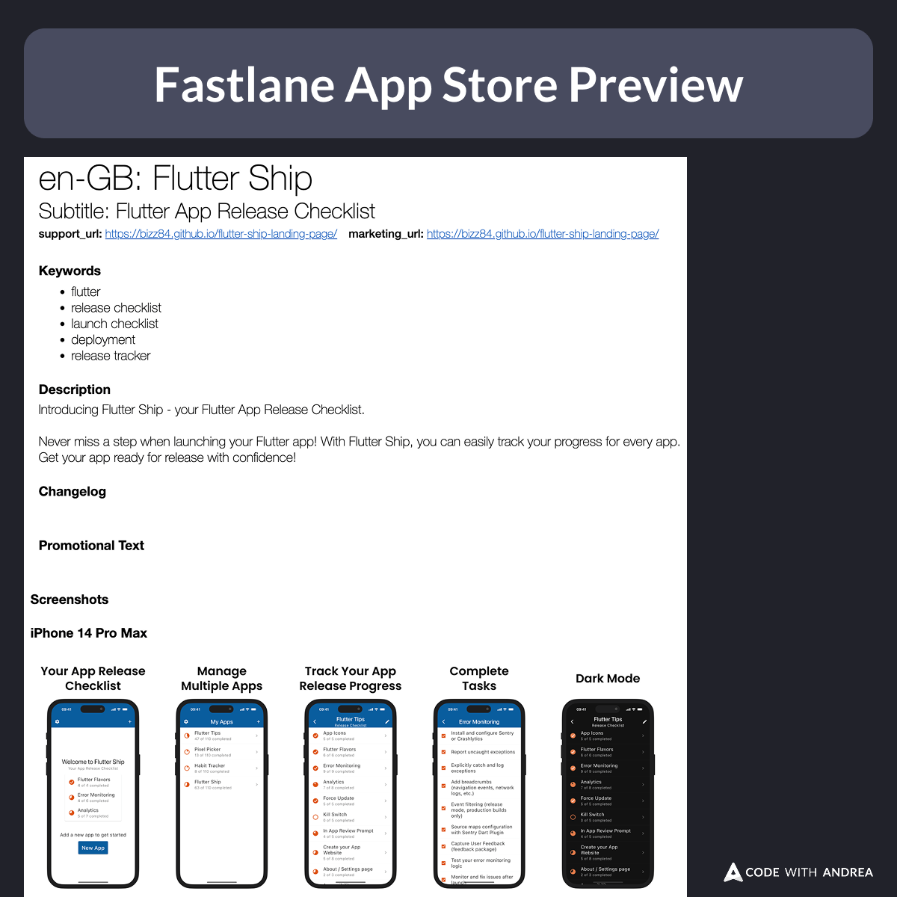

# Uploading Screenshots with Fastlane

Did you know?

Rather than uploading your app store screenshots manually, you can automate the process with Fastlane!

Here's how 👇

<!--
Initial Setup:

1. Run `brew install fastlane` (on macOS)
2. Run `fastlane init` from the ios folder
3. Configure `Appfile` with your Apple credentials
4. Add a lane to the `Fastfile`

default_platform(:ios)

platform :ios do
  desc "Upload screenshots to App Store Connect"
  lane :upload_screenshots_and_metadata do
    upload_to_app_store(
      skip_screenshots: false,
      skip_metadata: false,
      skip_binary_upload: true,
    )
  end
end

How to Upload:

1. Update the screenshots
2. Save the changes to git
3. Run the lane

fastlane upload_screenshots_and_metadata

Once done, all the screenshots will be uploaded to App Store Connect! 🚀

Android setup is very similar:

- Run fastlane init inside the android folder
- Use the upload_to_play_store action in the Fastfile
-->

Before uploading to the App Store, fastlane will show a preview so you can check if everything looks good.

You can skip this by passing `force: true` to the upload_to_app_store lane (useful for non-interactive CI workflows).

<!-- Fastlane App Store preview showing the metadata and screenshots -->

---

My latest course includes a whole module about screenshot automation, covering:

- ✅ Tips for better screenshots
- ✅ Capturing screenshots with Maestro
- ✅ Editing them with Figma
- ✅ Uploading them with Fastlane (locally & on CI)

Learn more here:
https://codewithandrea.com/courses/flutter-in-production/

---

| Previous | Next |
| -------- | ---- |
| [Using Semantics Identifiers for UI Testing](../0237-semantics-identifiers/index.md) |  |

<!-- TWITTER|https://x.com/biz84/status/1902295020217974868 -->
<!-- LINKEDIN|https://www.linkedin.com/posts/andreabizzotto_did-you-know-rather-than-uploading-your-activity-7308061624051904515-ya3- -->
<!-- BLUESKY|https://bsky.app/profile/codewithandrea.com/post/3lkpvkj4t6t2y -->