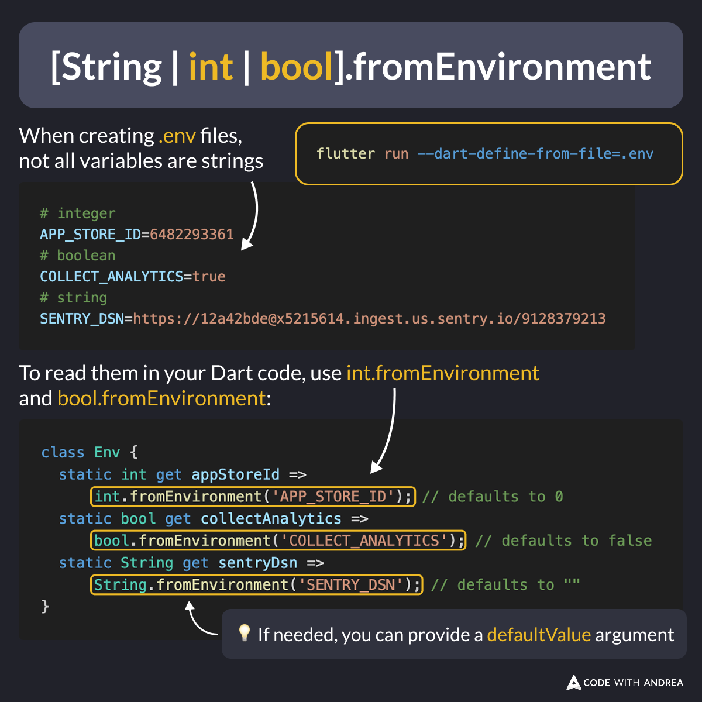

# int.fromEnvironment and bool.fromEnvironment

Did you know?

In addition to String.fromEnvironment, Dart also supports:

✅ int.fromEnvironment
✅ bool.fromEnvironment

Very handy when reading environment variables from your `.env` files:

<!--

When creating .env files, not all variables are strings. Example:

# integer
APP_STORE_ID=6482293361
# boolean
COLLECT_ANALYTICS=true
# string
SENTRY_DSN=https://12a42bde@x5215614.ingest.us.sentry.io/9128379213

To read them in your Dart code, use int.fromEnvironment and bool.fromEnvironment:

class Env {
  static int get appStoreId =>
      int.fromEnvironment('APP_STORE_ID'); // defaults to 0
  static bool get collectAnalytics =>
      bool.fromEnvironment('COLLECT_ANALYTICS'); // defaults to false
  static String get sentryDsn =>
      String.fromEnvironment('SENTRY_DSN'); // defaults to empty string
}

💡 If needed, you can provide a defaultValue argument

-->

To learn more about environment variables and best practices for storing API keys, read:

- [How to Store API Keys in Flutter: --dart-define vs .env files](https://codewithandrea.com/articles/flutter-api-keys-dart-define-env-files/)

---

| Previous | Next |
| -------- | ---- |
| [Hot Reload on Flutter web (beta)](../0239-hot-reload-flutter-web/index.md) | |

<!-- TWITTER|https://x.com/biz84/status/1905572370871390585 -->
<!-- LINKEDIN|https://www.linkedin.com/posts/andreabizzotto_did-you-know-in-addition-to-stringfromenvironment-activity-7311338221068509184-bu3J -->
<!-- BLUESKY|https://bsky.app/profile/codewithandrea.com/post/3llgnbomicc2m -->

