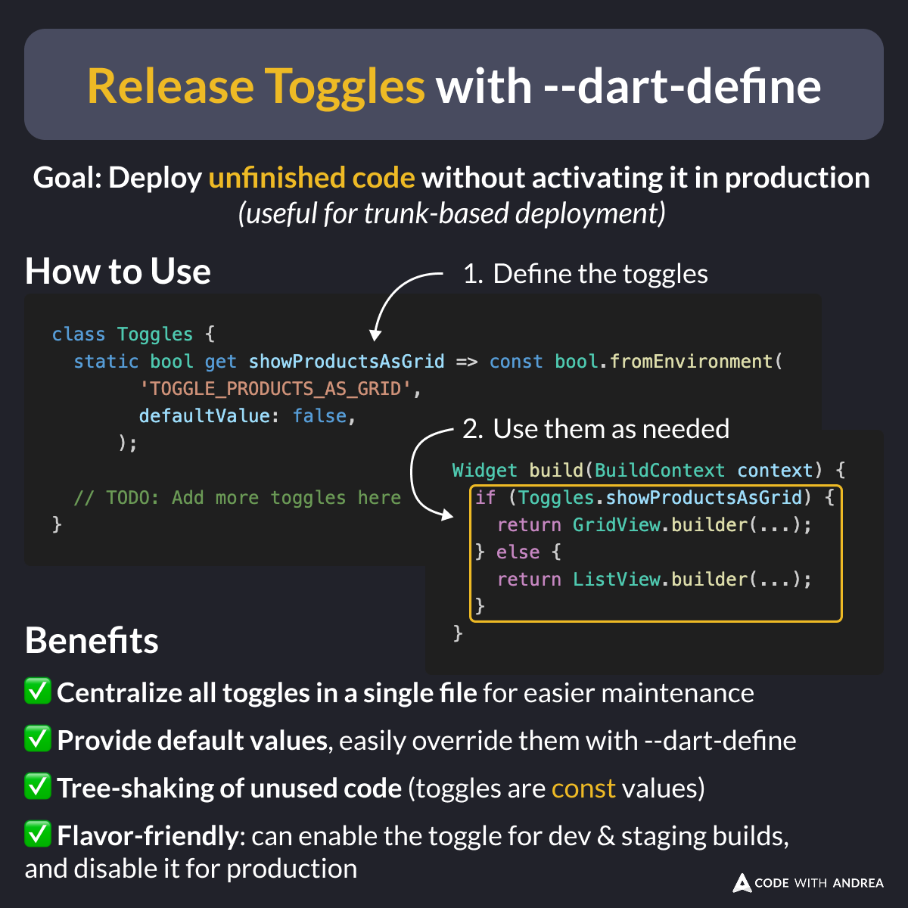

# Release Toggles with Dart Defines

Did you know?

Static release toggles let you release unfinished code without activating it in production.

This is common with large projects that practice trunk-based deployment and continuous delivery.

For more flexibility, you can implement this with --dart-defines. 👇

<!--

Goal: Deploy unfinished code without activating it in production
(useful for trunk-based deployment)

How to Use

1. Define the toggles

class Toggles {
  static bool get showProductsAsGrid => const bool.fromEnvironment(
        'TOGGLE_PRODUCTS_AS_GRID',
        defaultValue: false,
      );

  // TODO: Add more toggles here
}

2. Use them as needed

Widget build(BuildContext context) {
  if (Toggles.showProductsAsGrid) {
    return GridView.builder(...);
  } else {
    return ListView.builder(...);
  }
}

Benefits

- ✅ Centralize all toggles in a single file for easier maintenance
- ✅ Provide default values, easily override them with --dart-define
- ✅ Tree-shaking of unused code (toggles are const values)
- ✅ Flavor-friendly: can enable the toggle for dev & staging builds, and disable it for production

-->

---

Static release toggles are easy to use, but some use cases require more flexibility:

- Experiment by showing different variants to separate user cohorts (A/B and multivariate testing)
- Gradually roll out a feature to users, rather than releasing it to everyone at once

---

Complex use cases require dynamic toggles and some dedicated infrastructure to manage them, and my latest course covers this topic in much more detail.

Learn more here. 👇

- [Flutter in Production](https://codewithandrea.com/courses/flutter-in-production/)

---

| Previous | Next |
| -------- | ---- |
| [int.fromEnvironment and bool.fromEnvironment](../0240-int-bool-from-environment/index.md) | |

<!-- TWITTER|https://x.com/biz84/status/1907430520322928748 -->
<!-- LINKEDIN|https://www.linkedin.com/posts/andreabizzotto_did-you-know-static-release-toggles-let-activity-7313196425872355329-xJy6 -->
<!-- BLUESKY|https://bsky.app/profile/codewithandrea.com/post/3lltjwnidis22 -->

