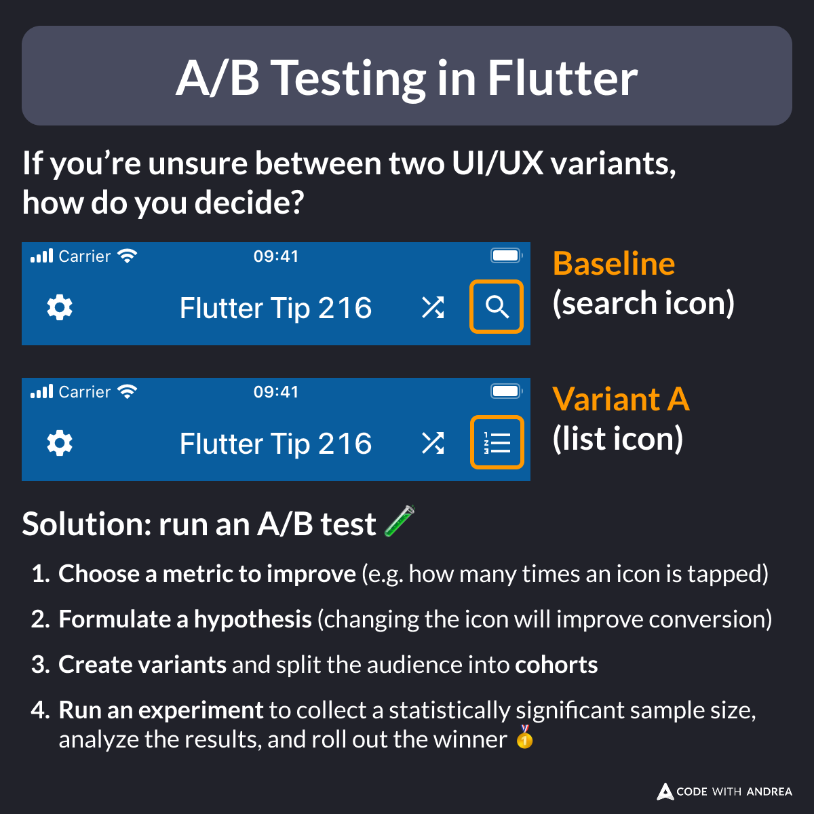
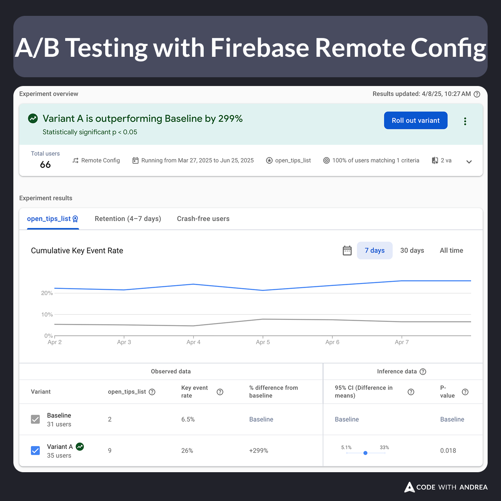

# A/B Testing in Flutter

Did you know?

A/B tests help you make data-driven decisions and increase conversions in your app.

To run an A/B test:
1. Choose a metric to improve
2. Formulate a hypothesis
3. Split the audience into cohorts
4. Run an experiment, analyze the results, and roll out the winner 🥇

<!--

If you’re unsure between two UI/UX variants, how do you decide?

Solution: run an A/B test 🧪

1. Choose a metric to improve (e.g. how many times an icon is tapped)
2. Formulate a hypothesis (changing the icon will improve conversion)
3. Create variants and split the audience into cohorts
4. Run an experiment to collect a statistically significant sample size, analyze the results, and roll out the winner

-->

---

Tools like Firebase Remote Config and PostHog make it easy to run A/B tests in your apps.

For example, here's a report from an A/B test I ran on my Flutter Tips app:

<!--

Screenshot showing the result of an A/B Testing experiment with Firebase Remote Config

-->

---

But how do you implement this in practice?

My latest course includes an entire module about Feature Toggles and A/B tests.

Learn more here:

- [Flutter in Production](https://codewithandrea.com/courses/flutter-in-production/)

---

| Previous | Next |
| -------- | ---- |
| [Release Toggles with Dart Defines](../0241-release-toggles-dart-define/index.md) | |

<!-- TWITTER|https://x.com/biz84/status/1909568197428117880 -->
<!-- LINKEDIN|https://www.linkedin.com/posts/andreabizzotto_did-you-know-ab-tests-help-you-make-data-driven-activity-7315334631447232512-lkfm -->
<!-- BLUESKY|https://bsky.app/profile/codewithandrea.com/post/3lmceptwbxc2z -->
