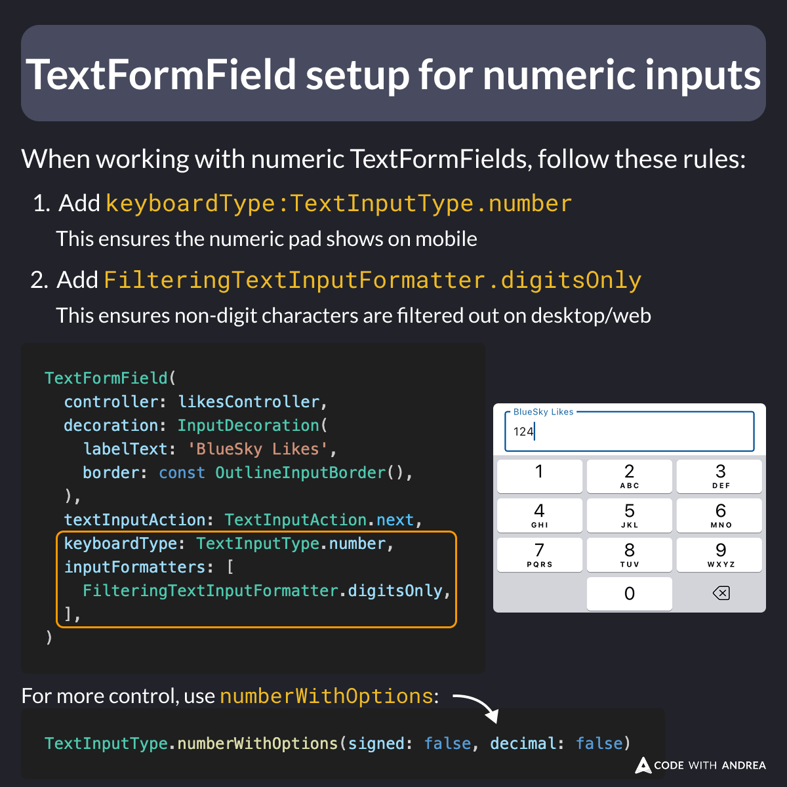

# TextFormField Setup for Numeric Inputs

Did you know?

When working with forms in Flutter, numeric inputs need special attention.

To improve the user experience:

1. Add `keyboardType: TextInputType.number`
2. Add `FilteringTextInputFormatter.digitsOnly` as an inputFormatter

Your users will thank you!

<!--
When working with numeric TextFormFields, follow these rules:

1. Add keyboardType:TextInputType.number (this ensures the numeric pad shows on mobile)
2. Add FilteringTextInputFormatter.digitsOnly (this ensures non-digit characters are filtered out on desktop/web)

TextFormField(
  controller: likesController,
  decoration: InputDecoration(
    labelText: 'BlueSky Likes',
    border: const OutlineInputBorder(),
  ),
  textInputAction: TextInputAction.next,
  keyboardType: TextInputType.number,
  inputFormatters: [
    FilteringTextInputFormatter.digitsOnly,
  ],
)

For more control, use numberWithOptions:

TextInputType.numberWithOptions(signed: false, decimal: false)
-->

---

| Previous | Next |
| -------- | ---- |
| [Showing URLs on Flutter web with TextSpan](../0243-show-flutter-web-url-text-span/index.md) | [How to use debugRepaintRainbowEnabled](../0245-debug-repaint-rainbow-enabled/index.md) |

<!-- TWITTER|https://x.com/biz84/status/1912151340190425174 -->
<!-- LINKEDIN|https://www.linkedin.com/posts/andreabizzotto_did-you-know-when-working-with-forms-in-activity-7317917226840330241-ROgi -->
<!-- BLEUSKY|https://bsky.app/profile/codewithandrea.com/post/3lmuc544tkc2l -->