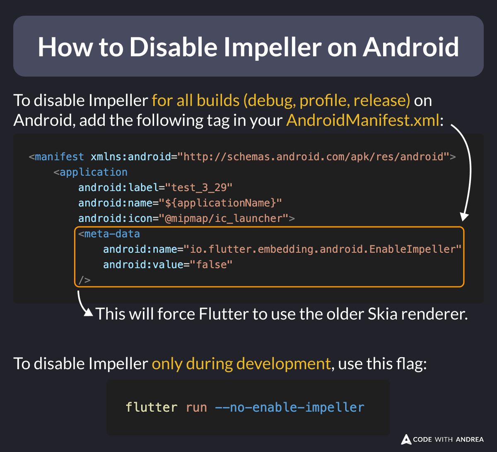

# How to Disable Impeller on Android

Did you know?

Since Flutter 3.29, Impeller is enabled by default on Android, but it can cause some rendering issues on some devices.

If needed, here's how to disable it and revert to the old Skia renderer. 👇

<!--

To disable Impeller for all builds (debug, profile, release) on Android, add the following tag in your AndroidManifest.xml:

<manifest xmlns:android="http://schemas.android.com/apk/res/android">
    <application
        android:label="test_3_29"
        android:name="${applicationName}"
        android:icon="@mipmap/ic_launcher">
        <meta-data
            android:name="io.flutter.embedding.android.EnableImpeller"
            android:value="false"
        />     

To disable Impeller only during development, use this flag:

flutter run --no-enable-impeller
-->

---

| Previous | Next |
| -------- | ---- |
| [How to use debugRepaintRainbowEnabled](../0245-debug-repaint-rainbow-enabled/index.md) | [How to Initialize Firebase Remote Config](../0247-firebase-remote-config-init/index.md) |

<!-- TWITTER|https://x.com/biz84/status/1917195051282882814 -->
<!-- LINKEDIN|https://www.linkedin.com/posts/andreabizzotto_did-you-know-since-flutter-329-impeller-activity-7322960928092614656-y3a4 -->
<!-- BLUESKY|https://bsky.app/profile/codewithandrea.com/post/3lnxbzya7oc23 -->
