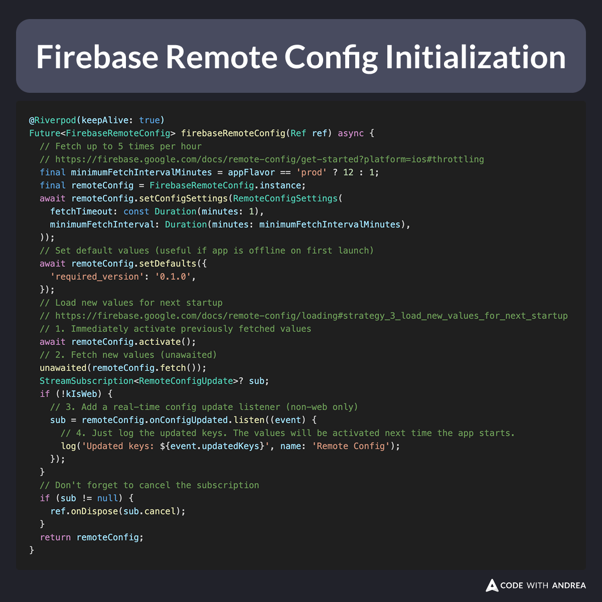

# Firebase Remote Config Loading Strategies

Firebase Remote Config is great, but it's a bit tricky to configure it correctly.

Here's my battle-tested loading strategy:

- 1️⃣ setup fetch interval (flavor-dependent)
- 2️⃣ set default values
- 3️⃣ activate previous values
- 4️⃣ fetch new values (unawaited)
- 5️⃣ add a realtime listener (which is not subject to the `minimumFetchInterval`)

<!--
@Riverpod(keepAlive: true)
Future<FirebaseRemoteConfig> firebaseRemoteConfig(Ref ref) async {
  final minimumFetchIntervalMinutes = appFlavor == 'prod' ? 12 : 1;
  final remoteConfig = FirebaseRemoteConfig.instance;
  await remoteConfig.setConfigSettings(RemoteConfigSettings(
    fetchTimeout: const Duration(minutes: 1),
    minimumFetchInterval: Duration(minutes: minimumFetchIntervalMinutes),
  ));
  await remoteConfig.setDefaults({
    'required_version': '0.1.0',
  });
  await remoteConfig.activate();
  unawaited(remoteConfig.fetch());
  StreamSubscription<RemoteConfigUpdate>? sub;
  if (!kIsWeb) {
    sub = remoteConfig.onConfigUpdated.listen((event) {
      log('Updated keys: ${event.updatedKeys}', name: 'Remote Config');
    });
  }
  if (sub != null) {
    ref.onDispose(sub.cancel);
  }
  return remoteConfig;
}
-->

---

Want to use this in your apps? Grab it from this gist:

- [Flutter Remote Config boilerplate code (using Riverpod)](https://gist.github.com/bizz84/5bdbc7685564e43c9cdfe5b658248f4b)

---

For more info about common loading strategies, read:

- [Firebase Remote Config loading strategies](https://firebase.google.com/docs/remote-config/loading)

---

My latest course shows how to use Firebase Remote Config in useful scenarios such as force updates and A/B tests.

Learn more here 👇

- [Flutter in Production](https://codewithandrea.com/courses/flutter-in-production/)

---

| Previous | Next |
| -------- | ---- |
| [How to Disable Impeller on Android](../0246-disable-impeller-android/index.md) | |

<!-- TWITTER|https://x.com/biz84/status/1917490060662038589 -->
<!-- LINKEDIN|https://www.linkedin.com/posts/andreabizzotto_firebase-remote-config-is-great-but-its-activity-7323257186095120385-ioPy -->
<!-- BLUESKY|https://bsky.app/profile/codewithandrea.com/post/3lnzdvjmiac23 -->
