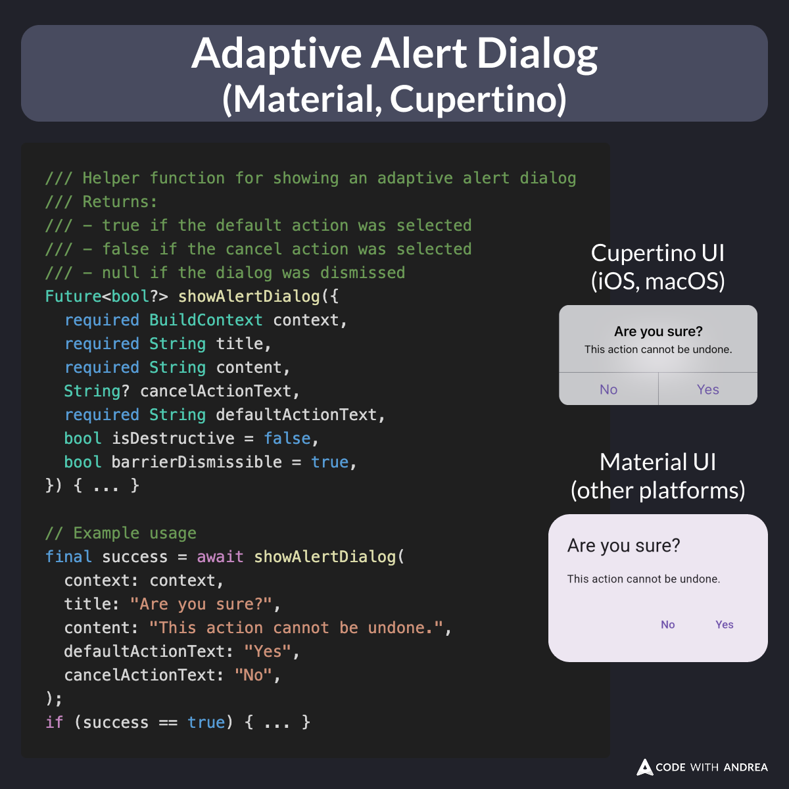

# Adaptive Alert Dialog (Material, Cupertino)

In many of my projects, I use a simple alert dialog that supports:

- Adaptive mode (Material / Cupertino)
- Default and cancel actions
- Destructive UI style
- Dismissible mode

Super useful for Yes/No, Cancel/Delete scenarios. 👍

See below for the source code.

<!--
/// Helper function for showing an adaptive alert dialog
/// Returns:
/// - true if the default action was selected
/// - false if the cancel action was selected
/// - null if the dialog was dismissed
Future<bool?> showAlertDialog({
  required BuildContext context,
  required String title,
  required String content,
  String? cancelActionText,
  required String defaultActionText,
  bool isDestructive = false,
  bool barrierDismissible = true,
}) { ... }

// Example usage
final success = await showAlertDialog(
  context: context,
  title: "Are you sure?",
  content: "This action cannot be undone.",
  defaultActionText: "Yes",
  cancelActionText: "No",
);
if (success == true) { ... }
-->

---

Here's a gist with the source code:

- [Helper function for showing an adaptive alert dialog (Material, Cupertino)](https://gist.github.com/bizz84/e23dd316ec601791f60b43325a31ab93)

Feel free to tweak and reuse it in your projects. 🙂

---

| Previous | Next |
| -------- | ---- |
| [How to Initialize Firebase Remote Config](../0247-firebase-remote-config-init/index.md) | [Test your UI with ThemeData.platform](../0249-themedata-platform/index.md) |

<!-- TWITTER|https://x.com/biz84/status/1917863560081821811 -->
<!-- LINKEDIN|https://www.linkedin.com/posts/andreabizzotto_in-many-of-my-projects-i-use-a-simple-alert-activity-7323629404767608833-7l43 -->
<!-- BLUESKY|https://bsky.app/profile/codewithandrea.com/post/3lo3wk6phne23 -->