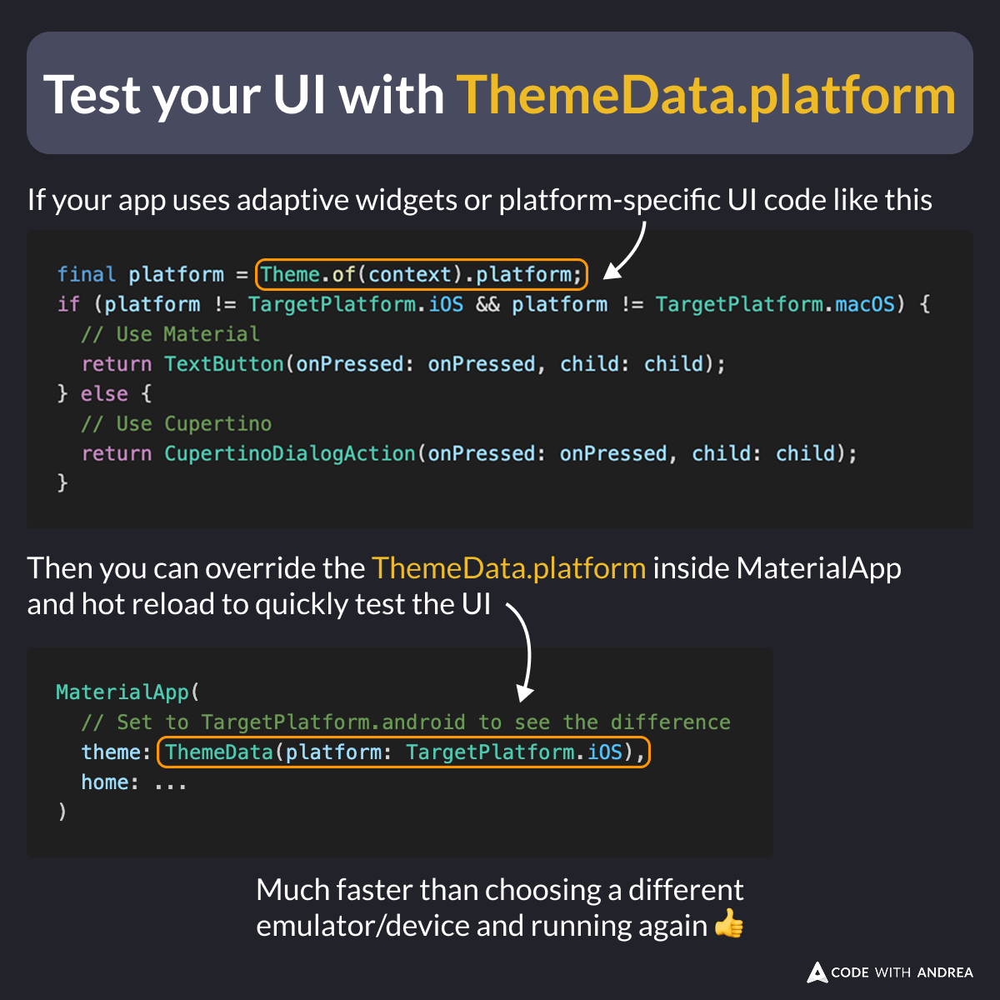

# Test your UI with ThemeData.platform

Did you know?

By overriding `ThemeData.platform` inside `MaterialApp`, you can quickly test all your adaptive UI code, such as:

- all adaptive widgets
- any conditional code that checks the platform

Much faster than choosing a different emulator/device and running from scratch 👍

<!--

// If your app has platform-specific UI code like this
final platform = Theme.of(context).platform;
if (platform != TargetPlatform.iOS && platform != TargetPlatform.macOS) {
  // Use Material
  return TextButton(onPressed: onPressed, child: child);
} else {
  // Use Cupertino
  return CupertinoDialogAction(onPressed: onPressed, child: child);
}

// Then you can update the ThemeData.platform inside MaterialApp and hot reload to quickly test the UI

MaterialApp(
  // Set to TargetPlatform.android to see the difference
  theme: ThemeData(platform: TargetPlatform.iOS),
  home: ...
)

// Much faster than choosing a different emulator/device and running again 👍
-->

---

| Previous | Next |
| -------- | ---- |
| [Adaptive Alert Dialog (Material, Cupertino)](../0248-adaptive-alert-dialog/index.md) | [Button Styles in Material 3](../0250-button-styles-material3/index.md) |

<!-- TWITTER|https://x.com/biz84/status/1919713657971171620 -->
<!-- LINKEDIN|https://www.linkedin.com/posts/andreabizzotto_did-you-know-by-overriding-themedataplatform-activity-7325479508629741568-u8BB -->
<!-- BLUESKY|https://bsky.app/profile/codewithandrea.com/post/3loirckcv6k26 -->