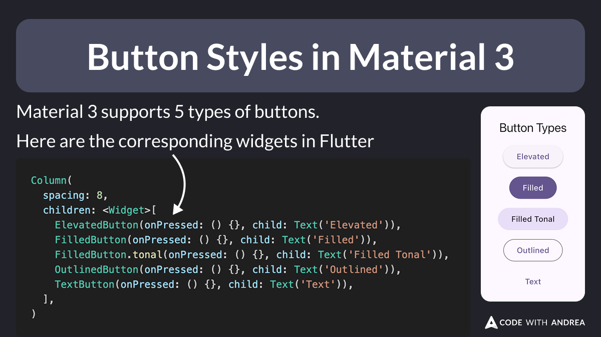

# Button Styles in Material 3

Did you know?

Material 3 supports 5 types of buttons:

- Elevated
- Filled
- Filled tonal
- Outlined
- Text

Here's how to use them in Flutter 👇

<!--

Material 3 supports 5 types of buttons.

Here are the corresponding widgets in Flutter:

Column(
  spacing: 8,
  children: <Widget>[
    ElevatedButton(onPressed: () {}, child: Text('Elevated')),
    FilledButton(onPressed: () {}, child: Text('Filled')),
    FilledButton.tonal(onPressed: () {}, child: Text('Filled Tonal')),
    OutlinedButton(onPressed: () {}, child: Text('Outlined')),
    TextButton(onPressed: () {}, child: Text('Text')),
  ],
)
-->

---

Example with source code:

- [Flutter button style example](https://github.com/flutter/flutter/blob/master/examples/api/lib/material/button_style/button_style.0.dart)

More complex example with custom icons and LTR/RTL support:

- [Flutter button style example with icons, LTR/RTL support](https://github.com/flutter/flutter/blob/master/examples/api/lib/material/button_style_button/button_style_button.icon_alignment.0.dart)

---

| Previous | Next |
| -------- | ---- |
| [Test your UI with ThemeData.platform](../0249-themedata-platform/index.md) | |

<!-- TWITTER|https://x.com/biz84/status/1920049708824736120 -->
<!-- LINKEDIN|https://www.linkedin.com/posts/andreabizzotto_did-you-know-material-3-supports-5-types-activity-7325815699250077696-0tNS -->
<!-- BLUESKY|https://bsky.app/profile/codewithandrea.com/post/3lol3w42kzc26 -->

