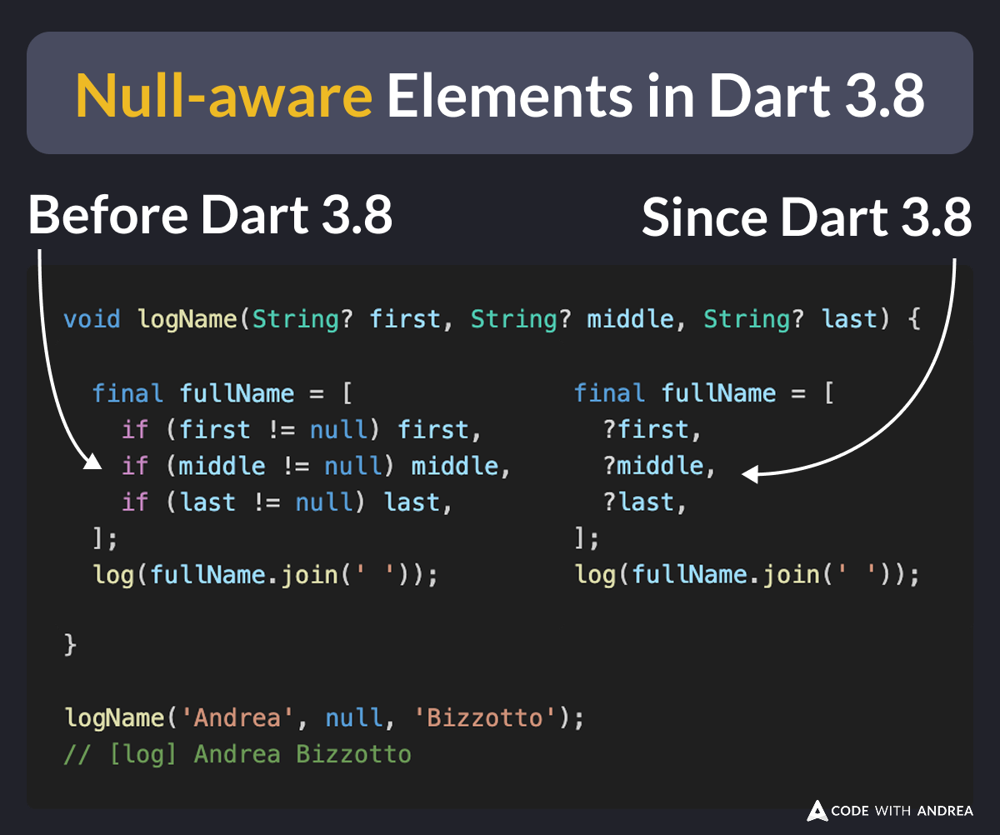
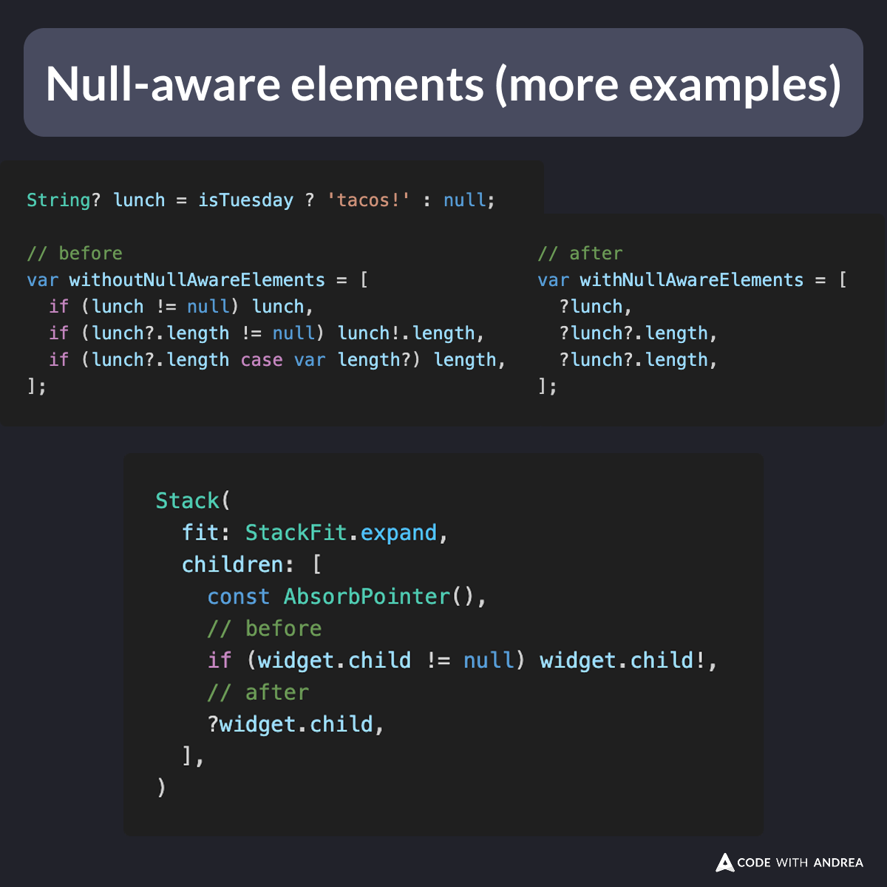

# Null-aware elements in Dart 3.8

Did you know?

Dart 3.8 introduces null-aware elements!

This allows you to add **nullable** elements to a collection with a single character (?).

Much shorter than using the collection-if syntax. 👍

<!--

void logName(String? first, String? middle, String? last) {
  // Before Dart 3.8
  final fullName = [
    if (first != null) first,
    if (middle != null) middle,
    if (last != null) last,
  ];

  // Since Dart 3.8
  final fullName = [
    ?first,
    ?middle,
    ?last,
  ];
  log(fullName.join(' '));
}

logName('Andrea', null, 'Bizzotto');
// [log] Andrea Bizzotto

-->

---

Here are some more examples (from the docs) showing how you might use this:

<!--
// Example 1
String? lunch = isTuesday ? 'tacos!' : null;

// before
var withoutNullAwareElements = [
  if (lunch != null) lunch,
  if (lunch?.length != null) lunch!.length,
  if (lunch?.length case var length?) length,
];

// after
var withNullAwareElements = [
  ?lunch,
  ?lunch.length,
  ?lunch.length,
];

// Example 2
Stack(
  fit: StackFit.expand,
  children: [
    const AbsorbPointer(),
    // before
    if (widget.child != null) widget.child!,
    // after
    ?widget.child,
  ],
)
-->

---

More details on the feature specification:

- [Null-aware elements](https://github.com/dart-lang/language/issues/323)

---

| Previous | Next |
| -------- | ---- |
| [GoRouter Delegate Listener for Screen Tracking](../0251-go-router-delegate-listener/index.md) | [Preserve Trailing Commas in Dart 3.8](../0253-preserve-commas/index.md) |

<!-- TWITTER|https://x.com/biz84/status/1925097550551355480 -->
<!-- LINKEDIN|https://www.linkedin.com/posts/andreabizzotto_did-you-know-dart-38-introduces-null-aware-activity-7330863488443023361-HJ26 -->
<!-- BLUESKY|https://bsky.app/profile/codewithandrea.com/post/3lpo4sw4tdc2o -->