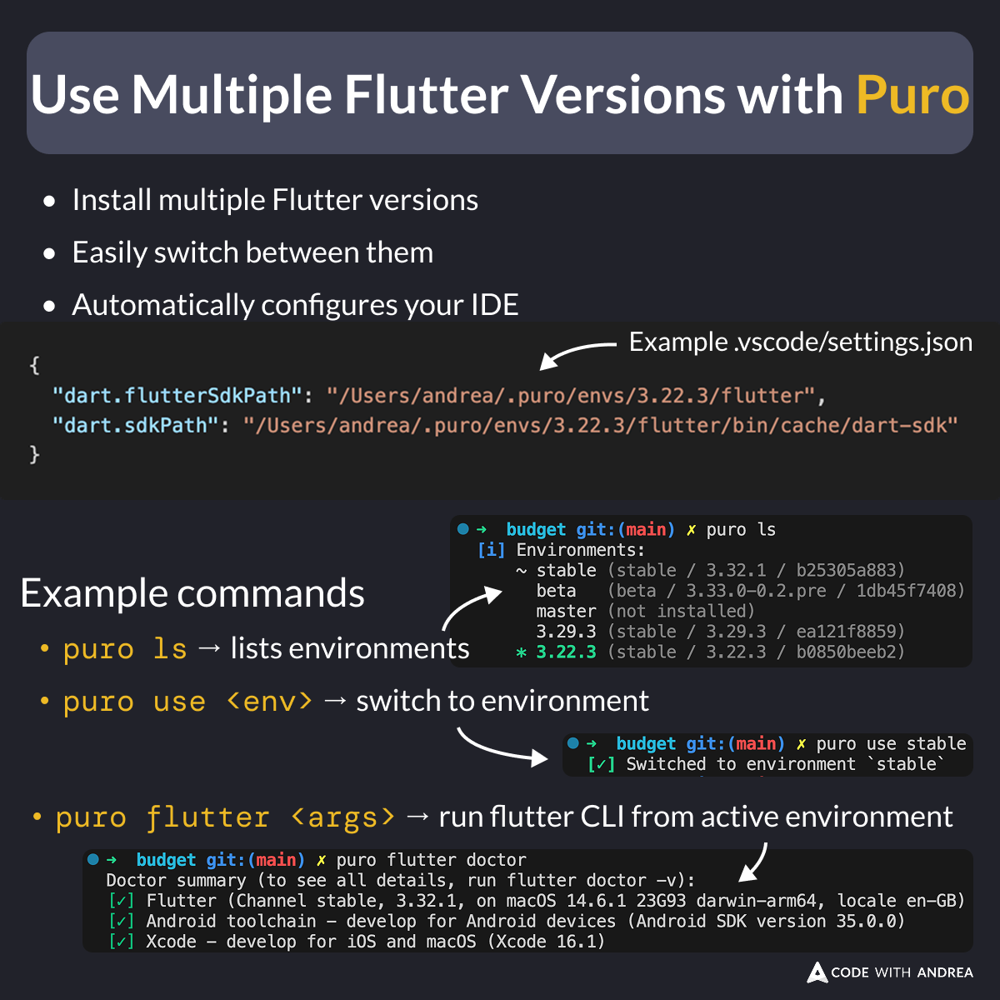

# Use Multiple Flutter Versions with Puro

Did you know?

Puro is a powerful tool that lets you install multiple versions of Flutter and easily switch between them in your projects.

It's very fast and can automatically configure your IDE to use your desired Flutter version.

<!--

- Install multiple Flutter versions
- Easily switch between them
- Automatically configure your IDE

Example commands:

- `puro ls`: lists environments
- `puro use <version>`: switch to environment
- `puro flutter <args>`: run flutter CLI from active environment

-->

---

Before Puro, I was using FVM.

But after trying it, I have converted:
- Faster downloads
- Better IDE integration
- Nicer CLI interface

Learn more and install here:
[https://puro.dev/](https://puro.dev/)

---

| Previous | Next |
| -------- | ---- |
| [Preserve Trailing Commas in Dart 3.8](../0253-preserve-trailing-commas-dart-3.8/index.md) | [Deprecated APIs in Matrix4](../0255-matrix4-vector3/index.md) |

<!-- TWITTER|https://x.com/biz84/status/1931999304337760702 -->
<!-- LINKEDIN|https://www.linkedin.com/posts/andreabizzotto_did-you-know-puro-is-a-powerful-tool-that-activity-7337765132606885888-5qB1 -->
<!-- BLUESKY|https://bsky.app/profile/codewithandrea.com/post/3lr5zap6fqc2n -->

