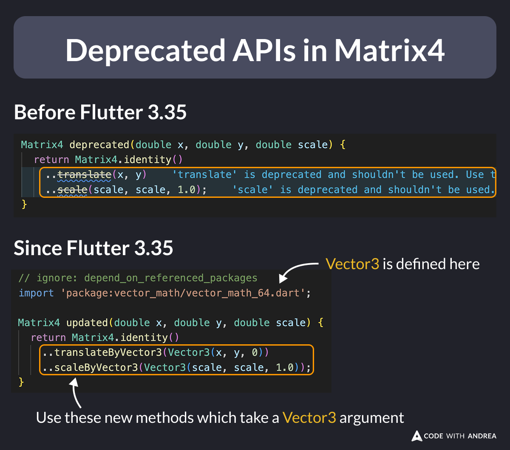

# Deprecated APIs in Matrix4

Did you know?

Some Matrix4 APIs such as `translate` and `scale` have been deprecated in the latest Flutter 3.35 release.

To update them:

- Import `vector_math` explicitly
- Use the new APIs which take a Vector3 argument

<!--
// Before Flutter 3.35
Matrix4 deprecated(double x, double y, double scale) {
  return Matrix4.identity()
    ..translate(x, y)
    ..scale(scale, scale, 1.0);
}

// Since Flutter 3.35
// ignore: depend_on_referenced_packages
import 'package:vector_math/vector_math_64.dart';

Matrix4 updated(double x, double y, double scale) {
  return Matrix4.identity()
    ..translateByVector3(Vector3(x, y, 0))
    ..scaleByVector3(Vector3(scale, scale, 1.0));
}
-->

---

| Previous | Next |
| -------- | ---- |
| [Use Multiple Flutter Versions with Puro](../0254-multiple-flutter-versions-puro/index.md) | |

<!-- TWITTER|https://x.com/biz84/status/1963179034596065692 -->
<!-- LINKEDIN|https://www.linkedin.com/posts/andreabizzotto_did-you-know-some-matrix4-apis-such-as-activity-7368945020202033156-LyAb -->
<!-- BLUESKY|https://bsky.app/profile/codewithandrea.com/post/3lxwelnjst222 -->
